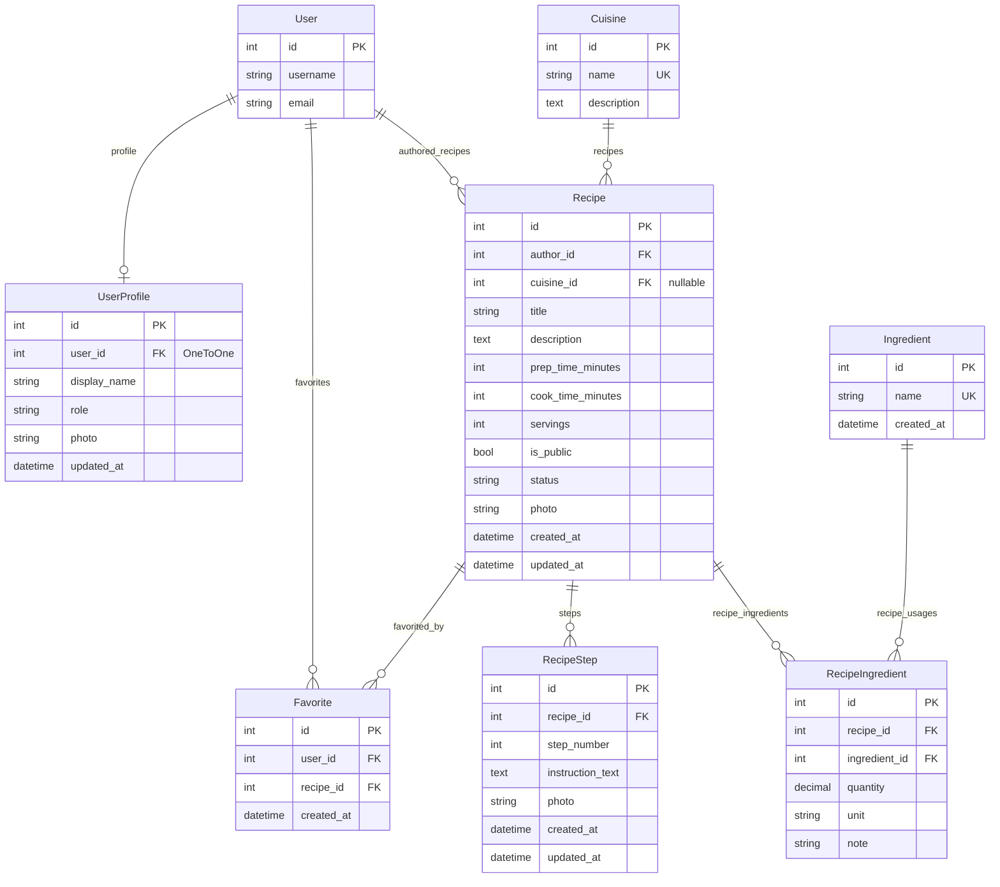

## Техническое задание (ТЗ) — актуализация по реализации

### Проект: Система управления рецептами
### Стек: Django 5 + Django REST Framework (DRF) + Vue.js 3 + Pinia + SQLite

*Документ обновлён с учётом фактической реализации репозитория. Устаревшие фрагменты исходного ТЗ заменены или помечены.*

---

## 1. Общие сведения

- **Название системы**: Система управления рецептами (Recipe Management System)
- **Назначение**: создание, хранение и поиск **своих** рецептов, справочники кухонь и ингредиентов, состав и шаги рецепта, избранное, панель метрик.
- **Тип приложения**: веб-приложение (Frontend SPA + Backend REST API).
- **Технологический стек (фактический)**:
  - Backend: **Django 5**, **DRF**, **django-filter**, **TokenAuthentication**, **SQLite**
  - Frontend: **Vue.js 3**, **Pinia**, **Vue Router**, **Vite**, **Axios**, **Bootstrap 5**
  - База данных: **SQLite** (`db.sqlite3`)
- **Целевая аудитория**: домашние кулинары, авторы рецептов; расширенная модерация через **Django Admin** (при наличии суперпользователя).

---

## 2. Предметная область

Система предназначена для пользователей, которые хотят:

- вести **личные** рецепты (описание, кухня, статус, публичность, фото);
- оформлять **состав** (справочные ингредиенты, количество, единица, примечание) и **шаги** с опциональным фото;
- пользоваться **справочниками** кухонь и ингредиентов (общие для всех пользователей API);
- сохранять рецепты в **избранное** (с учётом правил видимости на бэкенде);
- просматривать **дашборд** со сводной статистикой (`/api/statistics/`).

---

## 3. Роли и права пользователей (фактическая модель)

| Роль в ТЗ | Факт в приложении |
|-----------|-------------------|
| **Пользователь** | Реализовано: регистрация создаёт `User` + `UserProfile` с полем `role` (`user` / `admin` в модели). Доступ к API по **токену** `Authorization: Token <key>`. |
| Рецепты | Пользователь видит и изменяет **только свои** рецепты (`RecipeViewSet.get_queryset` по `author`). |
| Кухни / ингредиенты | **Любой аутентифицированный** пользователь может CRUD по `Cuisine` и `Ingredient` (нет отдельной проверки «только админ» в ViewSet). |
| **Администратор** | Поле `UserProfile.role = admin` в БД есть; **отдельного сценария модерации в SPA нет**. Полноценное управление пользователями и контентом — через **Django Admin** (`/admin/`) при `createsuperuser`. |

---

## 4. Функциональные требования — статус реализации

Формулировки сохранены в духе исходного ТЗ; добавлена колонка **Статус**.

| № | Требование | Статус | Пояснение |
|---|------------|--------|-----------|
| 1 | Регистрация пользователя | **Реализовано** | `POST /api/auth/register/`, форма на фронтенде; создаётся профиль и токен. |
| 2 | Авторизация и выход | **Реализовано** | Вход: `POST /api/auth/login/`; выход: очистка токена на клиенте. |
| 3 | Просмотр списка **публичных** рецептов всех пользователей | **Не реализовано** (в заявленном виде) | Список `GET /api/recipes/` возвращает **только рецепты текущего автора**. Общая «лента публичных» рецептов в API/SPA не делалась. Частично: публичность (`is_public`) учитывается при добавлении в избранное. |
| 4 | CRUD рецептов в рамках прав | **Реализовано** | Полный CRUD для своих рецептов; чужие недоступны через API. |
| 5 | Ингредиенты рецепта (кол-во, ед., примечание) | **Реализовано** | Модель `RecipeIngredient`, API `/api/recipe-ingredients/`, UI на странице рецепта. |
| 6 | Шаги приготовления с порядком | **Реализовано** | `RecipeStep`, уникальность `(recipe, step_number)`, API `/api/recipe-steps/`, UI на странице рецепта. |
| 7 | Фото рецепта и шагов | **Реализовано** | `ImageField` у `Recipe` и `RecipeStep`; загрузка через API/multipart. |
| 8 | Категория кухни у рецепта | **Реализовано** | FK `Recipe.cuisine` → `Cuisine`. |
| 9 | Поиск рецептов по названию/описанию | **Реализовано** | `SearchFilter` по полям `title`, `description`. |
| 10 | Фильтрация рецептов по одному или нескольким ингредиентам | **Не реализовано** | В `RecipeViewSet` нет `filterset_fields` по ингредиентам; фильтры: `cuisine`, `status`, `is_public`. Отбор «рецепты, где есть ингредиент X» возможен только косвенно (отдельные запросы к `recipe-ingredients`), но не в виде одного фильтра списка рецептов. |
| 11 | Фильтрация по кухне | **Реализовано** | Query `?cuisine=<id>`. |
| 12 | Сортировка списка рецептов | **Реализовано** | `ordering` по полям из `RecipeViewSet.ordering_fields`. |
| 13 | Добавление в избранное | **Реализовано** | `POST /api/favorites/`, ограничения для приватных чужих рецептов в `perform_create`. |
| 14 | Просмотр и редактирование избранного | **Реализовано** | Список, PATCH, DELETE по записям избранного. |
| 15 | Подробная страница рецепта | **Реализовано** | Карточка: поля, фото, состав, шаги, действия редактирования/удаления. |
| 16 | Редактирование/удаление только автором (и админом в ТЗ) | **Частично** | Автор: да, через queryset. **Модераторский сценарий в SPA отсутствует**; суперпользователь может править данные через Django Admin. |
| 17 | Управление кухнями администратором | **Частично / иначе** | CRUD кухонь доступен **всем аутентифицированным**, не только роли admin. |
| 18 | Модерация рецептов администратором | **Не реализовано в SPA** | Нет экранов модерации; возможности Django Admin для суперпользователя не считаются реализацией требования «в системе» в смысле исходного ТЗ. |

**Дополнительно реализовано сверх перечня:** эндпоинт **`GET /api/statistics/`**, **`GET /api/health/`**, дашборд на фронтенде, управление профилем через **`/api/profiles/`**, отдельные списки ингредиентов и кухонь с фильтрами, пагинация, toasts, тесты (`recipes/tests/`).

---

## 5. Нефункциональные требования — статус

| № | Требование | Статус | Пояснение |
|---|------------|--------|-----------|
| 1 | Адаптивный интерфейс | **Частично** | Bootstrap, offcanvas для мобильного меню; без отдельного макета «mobile-first». |
| 2 | Обработка ошибок и сообщения | **Реализовано** | Toasts (успех/ошибка), перехватчик Axios, валидация форм. |
| 3 | Пароль только в виде хэша | **Реализовано** | Стандартная модель `User` Django. |
| 4 | Разграничение доступа | **Реализовано** | IsAuthenticated + логика queryset/perform_create; см. отличия по кухням/публичной ленте. |
| 5 | Время отклика ≤ 500 мс | **Не проверялось** | Нет нагрузочных тестов в репозитории. |
| 6 | Целостность: нельзя рецепт без названия, шагов и ингредиентов | **Не реализовано** | Название обязательно на уровне модели; **шаги и ингредиенты не обязательны** при создании рецепта. |
| 7 | Локальный запуск без интернета после установки | **Реализовано** | См. README.md. |
| 8 | Серверное логирование без секретов | **Частично** | Поведение по умолчанию Django; отдельной настройки «production logging» в репозитории нет. |

---

## 6. Архитектура системы

Без изменений по смыслу: Vue SPA ↔ REST JSON ↔ Django ORM ↔ SQLite. Дополнительно: **CORS** (`django-cors-headers`), **пагинация** DRF (`PageNumberPagination`), **фильтры** django-filter.

---

## 7. Модель данных

### 7.1 Сущности (Django models)

Используется встроенная модель **`django.contrib.auth.models.User`**. Остальные сущности в приложении `recipes`:

| Модель | Назначение |
|--------|------------|
| **UserProfile** | 1:1 к `User`: `display_name`, `role`, `photo`, `updated_at` |
| **Cuisine** | Справочник кухонь: `name` (unique), `description` |
| **Recipe** | Рецепт: автор, кухня (FK, nullable), заголовок, описание, времена, порции, `is_public`, `status`, фото, метки времени |
| **Ingredient** | Справочник: `name` (unique), `created_at` |
| **RecipeIngredient** | Связь рецепт–ингредиент: `quantity`, `unit`, `note`; уникальность `(recipe, ingredient)` |
| **RecipeStep** | Шаг: `recipe`, `step_number`, `instruction_text`, фото; уникальность `(recipe, step_number)` |
| **Favorite** | Избранное: `user`, `recipe`, `created_at`; уникальность `(user, recipe)` |

### 7.2 ER-диаграмма (соответствует финальным моделям)

*Связь User ↔ Recipe по полю `Recipe.author`; User ↔ Favorite по `Favorite.user`. Ограничения уникальности в БД: `RecipeIngredient(recipe, ingredient)`, `RecipeStep(recipe, step_number)`, `Favorite(user, recipe)`.*

---

## 8. REST API

- **Базовый префикс**: `/api/`
- **Формат**: JSON (кроме загрузки файлов — `multipart/form-data`)
- **Авторизация (фактическая)**: **`Authorization: Token <token>`** (DRF `TokenAuthentication`, не JWT и не `Bearer`)

Кастомных методов ViewSet через **`@action`** в коде **нет** — ниже перечислены только фактические маршруты.

### 8.1 Служебные и auth

| Метод | URL | Аутентификация | Назначение |
|-------|-----|----------------|------------|
| GET | `/api/health/` | Не требуется | Проверка доступности API (`{"status":"ok"}`) |
| GET | `/api/statistics/` | Требуется | Сводка для дашборда (счётчики, рецепты по кухням, последние записи) |
| POST | `/api/auth/register/` | Не требуется | Регистрация → **201**, тело: `token`, `user_id`, `username`, `email` |
| POST | `/api/auth/login/` | Не требуется | Вход → **200**, то же состав полей с токеном |

*Эндпоинта `/api/auth/me/` в проекте нет — профиль через `/api/profiles/`.*

### 8.2 Ресурсы (ModelViewSet → стандартные маршруты роутера)

Для каждого ресурса: **GET/POST** `.../`, **GET/PATCH/PUT/DELETE** `.../{id}/` (имена с множественным числом и дефисами как в `DefaultRouter`).

| Ресурс | Base URL | Примечание |
|--------|----------|------------|
| Профили | `/api/profiles/` | Queryset только текущего пользователя |
| Кухни | `/api/cuisines/` | Полный queryset |
| Рецепты | `/api/recipes/` | Только `author=request.user` |
| Ингредиенты | `/api/ingredients/` | Полный queryset |
| Состав | `/api/recipe-ingredients/` | Только рецепты текущего автора |
| Шаги | `/api/recipe-steps/` | Только рецепты текущего автора |
| Избранное | `/api/favorites/` | Только записи текущего пользователя |

**Пагинация ответов списков:** объект с ключами `count`, `next`, `previous`, `results` (настройка `PAGE_SIZE` в DRF).

**Примеры query-параметров фильтрации** (django-filter, где задано `filterset_fields`):

- Рецепты: `cuisine`, `status`, `is_public`
- Кухни: `name`
- Ингредиенты: `name`
- Состав: `recipe`, `ingredient`, `unit`
- Шаги: `recipe`, `step_number`
- Избранное: `recipe`
- Профили: `role`

Плюс **`search`** и **`ordering`** в соответствии с `search_fields` / `ordering_fields` каждого ViewSet.

### 8.3 Админка Django

| Метод | URL | Назначение |
|-------|-----|------------|
| *HTML* | `/admin/` | Стандартная админка Django (не REST) |

---

## 9. Интерфейс (UI)

Прототипы **Figma** в проекте не использовались; в качестве эталона служит **реализованное приложение** (Vue + Bootstrap). Скриншоты размещаются в репозитории (рекомендуемый каталог: `docs/screenshots/`) и подключаются в документации.

### 9.1 Обязательные экраны — соответствие реализации

| Экран (ТЗ) | Реализация | Скриншот (файл-заглушка пути) |
|------------|------------|-------------------------------|
| Вход / Регистрация | `LoginView`, `RegisterView` | `docs/screenshots/01-login.png`, `docs/screenshots/02-register.png` |
| Главная / дашборд | `DashboardView` (метрики, последние записи) — вместо абстрактной «главной с подборками» | `docs/screenshots/03-dashboard.png` |
| Список рецептов | `RecipeListView` — таблица, фильтры (кухня, статус), поиск, пагинация | `docs/screenshots/04-recipes-list.png` |
| Детальный просмотр рецепта | `RecipeDetailView` — карточка, состав, шаги, добавление/редактирование состава и шагов | `docs/screenshots/05-recipe-detail.png` |
| Форма рецепта | `RecipeFormView` — поля рецепта и фото; **состав и шаги** — на странице деталей, не в одной форме с телом рецепта | `docs/screenshots/06-recipe-form.png` |
| Профиль | Отдельной страницы «Профиль» в SPA нет; данные пользователя в шапке, API `/api/profiles/` | `docs/screenshots/07-header-profile.png` *(опционально)* |
| Избранное | `FavoriteListView`, форма `FavoriteFormView`, деталь `FavoriteDetailView` | `docs/screenshots/08-favorites.png` |
| Справочники | `IngredientListView`, `CuisineListView` + формы и детальные страницы | `docs/screenshots/09-ingredients.png`, `docs/screenshots/10-cuisines.png` |

*Добавьте реальные PNG в указанные пути или обновите ссылки в этом документе после съёмки экрана.*

---

## 10. Отклонения от исходного ТЗ

Краткий перечень изменений в процессе разработки и причины:

1. **Лента «всех публичных рецептов»** не реализована: API списка рецептов ограничен автором для упрощения модели «личная кулинарная книга» и безопасности; публичность используется в правилах избранного, а не для общего каталога в UI.
2. **Фильтр рецептов по ингредиентам** не добавлен в `RecipeViewSet` — требует обратной связи через `RecipeIngredient` или аннотаций; в ТЗ не было детализировано; реализованы фильтры по кухне, статусу, публичности.
3. **Авторизация**: вместо JWT и `Bearer` используется **DRF Token** и заголовок **`Token`** — проще для учебного/локального проекта.
4. **Регистрация/логин**: в ТЗ фигурировали `email` в примерах тела; фактически аутентификация по **`username`** + password (как в сериализаторах).
5. **Кухни и ингредиенты** доступны на запись всем аутентифицированным, а не только администратору — ускоряет наполнение справочников без отдельной роли модератора в API.
6. **Состав и шаги** вынесены на **страницу рецепта** и отдельные эндпоинты, а не вложены в одно тело `POST /recipes/` — гибче для пошагового редактирования и multipart для фото шагов.
7. **Обязательность шагов и ингредиентов** при создании рецепта не enforced — сознательное упрощение; пользователь может добавить их позже.
8. **Эндпоинты** `/api/auth/me/`, `/api/photos/`, `DELETE /api/favorites/by-recipe/...` из черновика ТЗ **не внедрялись**; загрузка фото встроена в рецепт/шаги.
9. **Модерация и роль админа в SPA** не делались; администрирование — через Django Admin при необходимости.

---

## 11. Глоссарий

- **Рецепт (Recipe)** — карточка блюда с описанием, ингредиентами (через состав), шагами, фото и привязкой к кухне.
- **Ингредиент (Ingredient)** — элемент общего справочника.
- **Ингредиент в рецепте (RecipeIngredient)** — связь с количеством, единицей и примечанием.
- **Шаг приготовления (RecipeStep)** — нумерованная инструкция, опционально с фото.
- **Кухня (Cuisine)** — категория (тип кухни) для рецепта.
- **Избранное (Favorite)** — связь пользователь–рецепт с датой добавления.
- **DRF** — Django REST Framework.
- **SPA** — одностраничное приложение (Vue.js).
- **ORM** — слой доступа к данным Django.

---

*Версия документа: синхронизирована с кодовой базой проекта (модели `recipes/models.py`, маршруты `recipes/urls.py`, фронтенд `frontend/src`).*
